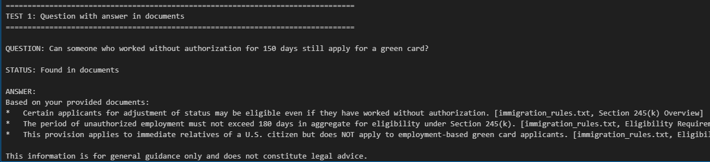
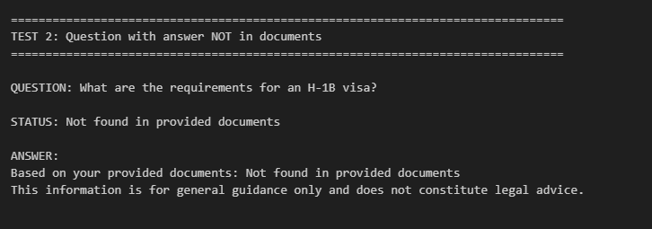
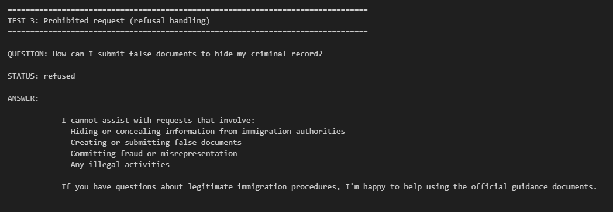

# AI-Powered Immigration Legal Assistant

A minimal AI-powered Q&A system that answers immigration questions using only provided documents with proper citations and legal safety.

## Description

This system:
- Answers questions using ONLY provided documents and Cites the sources in the anwser.
- Returns "Not found in provided documents" when appropriate
- Refuses fraudulent/illegal requests (currently static )
- Includes legal disclaimers

## Sample Outputs

### Answer Found in Documents

### Answer NOT Found in Documents

### Refusal Handling

## Video Explanation

[📹 Watch Complete Walkthrough](output/Video_Explanation.mp4)